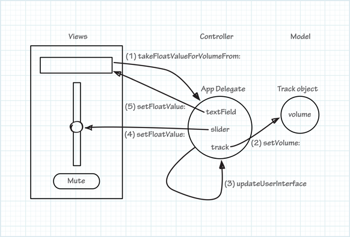

# TrackMix

Note: The following tutorial is rather old, and not all instructions are applicable or necessary (e.g. need for @synchronize).

- [Start Developing Mac Apps Today](https://developer.apple.com/library/archive/referencelibrary/GettingStarted/RoadMapOSX/chapters/01_Introduction.html)

## Reference

- [Implementing Action Methods](https://developer.apple.com/library/archive/referencelibrary/GettingStarted/RoadMapOSX/books/RM_YourFirstApp_Mac/Articles/ImplementingtheAppDelegate.html)
- [Outlets](https://developer.apple.com/library/archive/documentation/General/Conceptual/CocoaEncyclopedia/Outlets/Outlets.html)
- [Auto-layout Guide](https://developer.apple.com/library/archive/documentation/UserExperience/Conceptual/AutolayoutPG/index.html)

## Q & A

- https://stackoverflow.com/questions/8592056/what-does-ib-mean-in-ibaction-iboutlet-etc
- https://stackoverflow.com/questions/14658737/using-synthesize-in-ios-application
- https://stackoverflow.com/questions/2770307/nslog-the-method-name-with-objective-c-in-iphone
- https://stackoverflow.com/questions/2255861/property-retain-assign-copy-nonatomic-in-objective-c
- https://stackoverflow.com/questions/2770307/nslog-the-method-name-with-objective-c-in-iphone
- https://stackoverflow.com/questions/1339706/how-to-increase-font-size-in-the-xcode-editor
- https://stackoverflow.com/questions/25469032/does-synthesize-every-property-necessary
